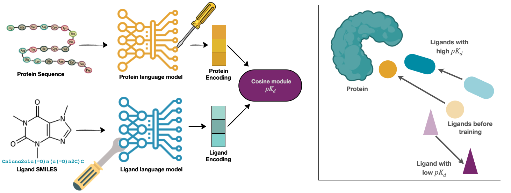

# Learning Binding Affinities via Fine-tuning of Protein and Ligand Language Models

Accurate *in-silico* prediction of protein-ligand binding affinity is essential for efficient hit identification in large molecular libraries. Commonly used structure-based methods such as giga-docking often fail to rank compounds effectively, and free energy-based approaches, while accurate, are too computationally intensive for large-scale screening. Existing deep learning models struggle to generalize to new targets or drugs, and current evaluation methods do not reflect real-world performance accurately.
We introduce **BALM**, a deep learning framework that predicts **b**inding **a**ffinity using pretrained protein and ligand **l**anguage **m**odels. BALM learns experimental binding affinities by optimizing cosine similarity in a shared embedding space. We also propose improved evaluation strategies with diverse data splits and metrics to better assess model performance. Using the BindingDB dataset, BALM shows strong generalization to unseen drugs, scaffolds, and targets. It excels in few-shot scenarios for targets such as *USP7* and *Mpro*, outperforming traditional machine learning and docking methods, including AutoDock Vina. Adoption of the target-based evaluation methods proposed will allow for more stringent evaluation of machine learning-based scoring tools. Frameworks such as BALM show good performance, are computationally efficient, and highly adaptable within this evaluation framework, making it a practical tool for early-stage drug discovery screening.




## 🚀 **Quick Start**

Get started with BALM using these tutorial notebooks:

- 📘 **Few-shot learning** with zero- and few-shot settings: [few_shot_demo.ipynb](scripts/notebooks/few_shot_demo.ipynb)
- 🧬 **Custom dataset usage**: [custom_data_demo.ipynb](scripts/notebooks/custom_data_demo.ipynb)

Explore the dataset and pretrained models:
- 📁 **Dataset**: [BALM-benchmark](https://huggingface.co/datasets/BALM/BALM-benchmark)
- 🧠 **Pretrained Models**: [BALM models](https://huggingface.co/BALM)

## 🛠️ **Setup**

### Create a conda environment (GPU)

```bash
conda env create -f environment.yaml
conda activate balm
```

### Create a conda environment (CPU)

```bash
conda create -n BALM python=3.10
conda activate balm
pip install -r requirements_cpu.txt
```

### Create an environment file

To download from/upload to HF hub, create a `.env` file containing
```
- WANDB_ENTITY  # For experiment logging to WandB
- WANDB_PROJECT_NAME  # For experiment logging to WandB
- HF_TOKEN  # Use your write token to give READ and WRITE privilege
```

Check `.env.example`. You can use it to create your own `.env` file.

### Dataset Access

We published our dataset via HuggingFace: https://huggingface.co/datasets/BALM/BALM-benchmark.
The code will automatically download the data from this link accordingly.
Check the dataset page to know more details about it!

## 🧪💻 **Training Models**

Execute the following command to start training with a specific configuration file:

```bash
python scripts/train.py --config_filepath path/to/config_file.yaml
```

You can find config files in the [`configs`](configs/) folder. Below are examples for training different models (BALM, BALM with PEFT and Baseline) on datasets we used in the study.

### Base model training

#### BindingDB training from scratch

To train BALM + PEFT on the BindingDB with random splits, you can run this config:

```bash
python scripts/train.py --config_filepath configs/bindingdb_random/esm_lokr_chemberta_loha_cosinemse_1.yaml
```

In the paper, we reported the average metrics across multiple runs, and these individual runs are denoted by the suffix of the YAML file (e.g., `_1`, `_2`, or `_3`). The difference is only on the random seed value (e.g., `12`, `123`, `1234`). You can use configs corrensponding to other splits (cold target, cold drug and scaffold) and models (BALM or Baseline) from [`configs`](configs/) folder.

#### LeakyPDB training from scratch

Similar to the BindingDB training, the LeakyPDB with training with BALM model can be run using this config:

```bash
python scripts/train.py --config_filepath configs/leakypdb/esm_chemberta_proj_tuning_cosinemse_1.yaml
```

### Zero-shot/Few-shot evaluation

Once you have access to a pretrained BALM, you can evaluate it on a zero-shot or few-shot setting using the Mpro and/or USP7 data:

Zero-shot:

```bash
python scripts/train.py --config_filepath configs/mpro/esm_chemberta_proj_tuning_cosinemse_train0_1.yaml
```

Note that in the name it says `train0`, which indicates 0% training set. Within the config file, you can look for `train_ratio: 0.0`.

On the other hand, if you want to fine tune the model in a few-shot manner:

```bash
python scripts/train.py --config_filepath configs/mpro/esm_chemberta_proj_tuning_cosinemse_train10_1.yaml
```

Similar to the zero-shot config files, within the config file of the few-shot fine-tuning, you can look for `train_ratio` argument which should have a value greater than `0.0`.

You can also evaluate using other data (e.g., USP7) by specifying the correct config file path.

## 💬 Feedback

Found a bug or wanted to suggest something? Please reach out via the [GitHub issues](https://github.com/meyresearch/BALM/issues).

## 📝 Citations

If you find the BALM model and benchmark useful in your research, please cite our paper:

```
@article{Gorantla2024,
  author = {Gorantla, Rohan and Gema, Aryo Pradipta and Yang, Ian Xi and Serrano-Morr{\'a}s, {\'A}lvaro and Suutari, Benjamin and Jim{\'e}nez, Jordi Ju{\'a}rez and Mey, Antonia S. J. S.},
  title = {Learning Binding Affinities via Fine-tuning of Protein and Ligand Language Models},
  year = {2024},
  doi = {10.1101/2024.11.01.621495},
  publisher = {Cold Spring Harbor Laboratory},
  journal = {bioRxiv}
}
```


## 📜 Licence 

See [LICENSE.md](LICENSE.md).

To discuss commercial use of our models, reach us [via email](mailto:antonia.mey@ed.ac.uk).

## 📫 Contact us

- Rohan Gorantla ([rohan.gorantla@ed.ac.uk](mailto:rohan.gorantla@ed.ac.uk))
- Aryo Pradipta Gema ([aryo.gema@ed.ac.uk](mailto:aryo.gema@ed.ac.uk))
- Antonia Mey ([antonia.mey@ed.ac.uk](mailto:antonia.mey@ed.ac.uk))
